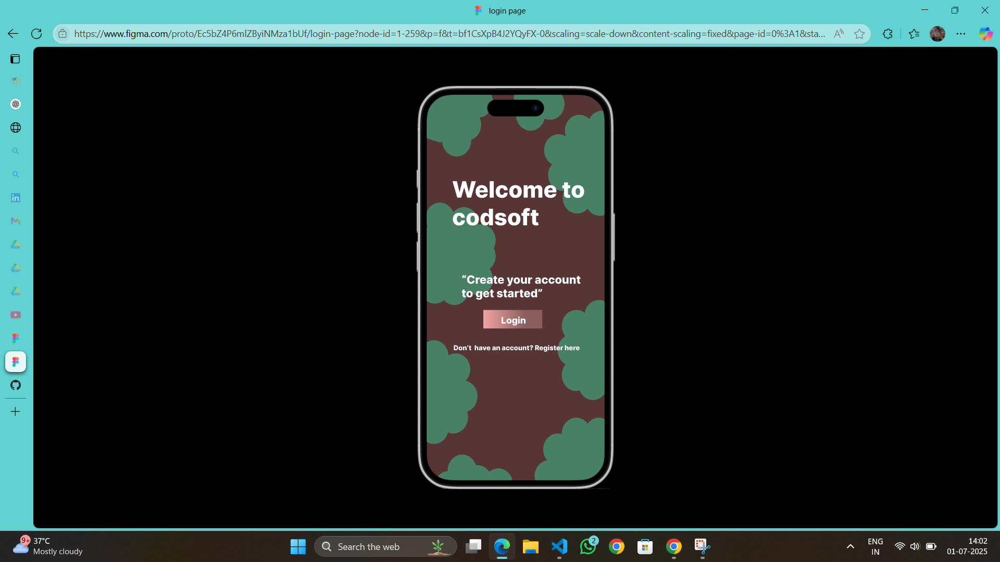
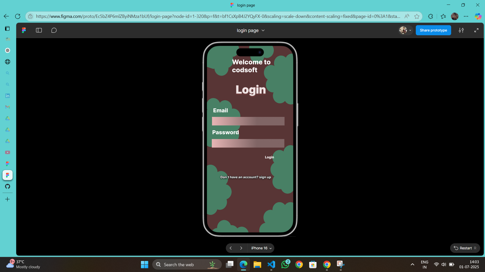
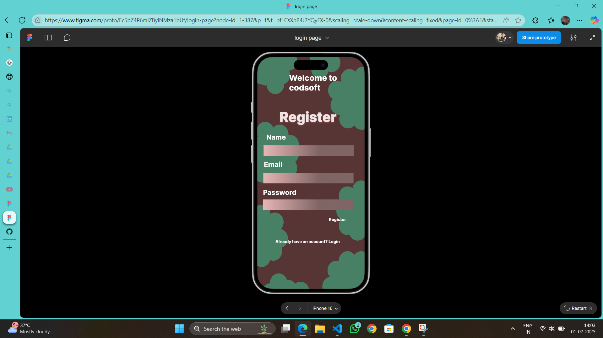

# codsoft

# CodSoft UI Design – Login & Registration Flow

This project showcases a **mobile UI design** created for the **CodSoft Internship** (July 2025 Batch B37). It includes a clean and consistent user interface for onboarding users through login and registration screens.

## 🎨 Tools Used
- **Figma** (for UI/UX design)
- iPhone 14 & 15 Pro frames

## 📱 Designed Screens
- Welcome Screen (pre-sign-up)
- Login Page (Email & Password)
- Registration Page (Name, Email, Password)
- Social Sign-In Options (LinkedIn, Browser)

## 🌟 Features
- Consistent color theme
- Mobile-optimized layout
- Clear call-to-action buttons
- Social login placeholder icons
- User-friendly navigation prompts

## 📎 Preview

## 🔗 View the Design in Figma
[Figma Project Link](https://www.figma.com/proto/Ec5bZ4P6mlZByiNMza1bUf/login-page?node-id=1-320&p=f&t=bf1CsXpB4J2YQyFX-0&scaling=scale-down&content-scaling=fixed&page-id=0%3A1&starting-point-node-id=1%3A259)

## 👩‍💻 Created By
**Saranya S**  
CodSoft Web Development Intern (July 2025)

---

> This UI is currently a design prototype and has not been implemented in code (HTML/CSS).
